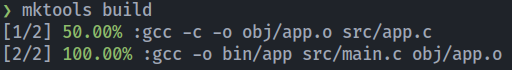

# MakeTools

[](https://crates.io/crates/make-tools)

## For viewing make progress!
## Make fast compile_comands.json
### If is not working for you should try [bear](https://github.com/rizsotto/Bear)
### cmd: `mktools`

# You should run `make clean` before `mktools compile-commands`



# Instalation
## You should have rust installed first!
```sh
cargo install make-tools
```
## If `mktools` is invalid command you should add ~/.cargo/bin to your PATH

# Supports compilers:

- gcc
- g++
- clang
- clang++
- x86_64-w64-mingw32-gcc
- x86_64-w64-mingw32-g++
- x86_64-w64-mingw32-clang
- x86_64-w64-mingw32-clang++

# Supports files:
- .c
- .cpp
- .c++
- .C
- .cxx
- .cc
